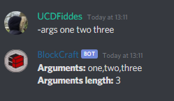

# -args

You can find out what the bot sees in your message by using this command...

## Permissions

Members that are able to use the args command are...

* Anyone

The permissions that the bot needs are...

* Send Messages
* Embed Links
* Use External Emojis

## Format


-args &lt;ARGUMENTS&gt;


### &lt;Arguments&gt;

Arguments are whatever you put after the first command...

### Example

