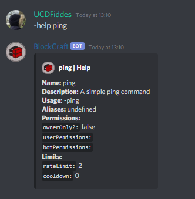
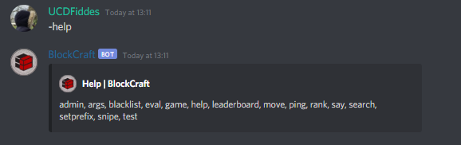

# -help

The help command gives a great amount of help when using the command...

## Permissions

Members that are able to use the args command are:

* Anyone

The permissions that the bot needs are...

* Send Messages
* Embed Links
* Use External Emojis

## Format


-help &lt;COMMAND&gt;


### &lt;COMMAND&gt;

This is any command that the bot has...

### Example

## Format \#2


-help


This returns a list of all the commands...

### Example

