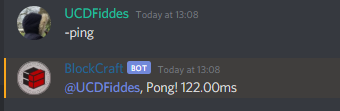

# -ping

Allows the member to see what their ping towards the server and the bot combined in one is...

## Permissions

Members that are able to use the ping command are...

* Anyone

The permissions that the bot needs are...

* Send Messages
* Embed Links
* Use External Emojis

## Format


-ping 


Returns a message stating the users ping...

### Example

