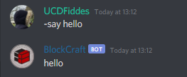

# -say

The say command allows you to have the bot say whatever you want it to say...

## Permissions

Members that are able to use the ping command are...

* Anyone

The permissions that the bot needs are...

* Send Messages
* Embed Links
* Use External Emojis

## Format


-say &lt;MESSAGE&gt;


### &lt;MESSAGE&gt;

The message you want Blockcraft to say...

### Example

